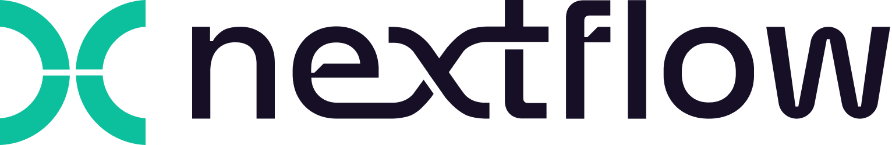

<picture>
  <source media="(prefers-color-scheme: dark)" srcset="docs/_static/nextflow-logo-bg-dark.png">
  <source media="(prefers-color-scheme: light)" srcset="docs/_static/nextflow-logo-bg-light.png">
  
</picture>

*"Dataflow variables are spectacularly expressive in concurrent programming"*
<br>[Henri E. Bal , Jennifer G. Steiner , Andrew S. Tanenbaum](https://dl.acm.org/doi/abs/10.1145/72551.72552)

[](https://github.com/nextflow-io/nextflow/actions/workflows/build.yml?query=branch%3Amaster+event%3Apush)
[](https://github.com/nextflow-io/nextflow/releases/latest)
[](https://twitter.com/nextflowio)
[](https://www.nature.com/articles/nbt.3820)
[](http://bioconda.github.io/recipes/nextflow/README.html)
[](https://github.com/nextflow-io/nextflow/blob/master/COPYING)

Nextflow is a workflow system for creating scalable, portable, and reproducible workflows. It is based on the dataflow programming model, which greatly simplifies the writing of parallel and distributed pipelines, allowing you to focus on the flow of data and computation. Nextflow can deploy workflows on a variety of execution platforms, including your local machine, HPC schedulers, AWS Batch, Azure Batch, Google Cloud Batch, and Kubernetes. Additionally, it supports many ways to manage your software dependencies, including Conda, Spack, Docker, Podman, Singularity, and more.

## Quick start

Install Nextflow with a single command:

```bash
curl -fsSL https://get.nextflow.io | bash
```

It creates the `nextflow` executable file in the current directory. You can then move it to a directory in your `$PATH` to run it from anywhere.

Nextflow can also be installed from Bioconda:

```bash
conda install -c bioconda nextflow
```

## Documentation

The Nextflow documentation is available for the latest [stable](https://nextflow.io/docs/latest/) and [edge](https://nextflow.io/docs/edge/) releases.

## Community

You can post questions and get help in the [Nextflow community forum](https://community.seqera.io) or the [Nextflow Slack](https://www.nextflow.io/slack-invite.html). Bugs and feature requests should be reported as [GitHub issues](https://github.com/nextflow-io/nextflow/issues/new/choose).

The Nextflow community is highly active with regular community meetings, events, a podcast and more. You can view much of this material on the [Nextflow](https://www.youtube.com/@Nextflow) and [nf-core](https://www.youtube.com/@nf-core) YouTube channels.

The [nf-core](https://nf-co.re/) project is a community effort aggregating high quality Nextflow workflows which can be used by everyone.

## Contributing

Contributions are more than welcome. See the [CONTRIBUTING](CONTRIBUTING.md) file for details.

## License

Nextflow is released under the Apache 2.0 license. Nextflow is a [registered trademark](https://github.com/nextflow-io/trademark).

## Citations

If you use Nextflow in your work, please cite:

P. Di Tommaso, et al. Nextflow enables reproducible computational workflows. Nature Biotechnology 35, 316–319 (2017) doi:[10.1038/nbt.3820](http://www.nature.com/nbt/journal/v35/n4/full/nbt.3820.html)

## Credits

Nextflow is built on two \*great* open-source software projects, <a href='http://groovy-lang.org' target='_blank'>Groovy</a>
and <a href='http://www.gpars.org/' target='_blank'>GPars</a>.

<a href='http://www.yourkit.com' target='_blank'>YourKit</a> is kindly supporting Nextflow with its fully-featured Java Profiler.
