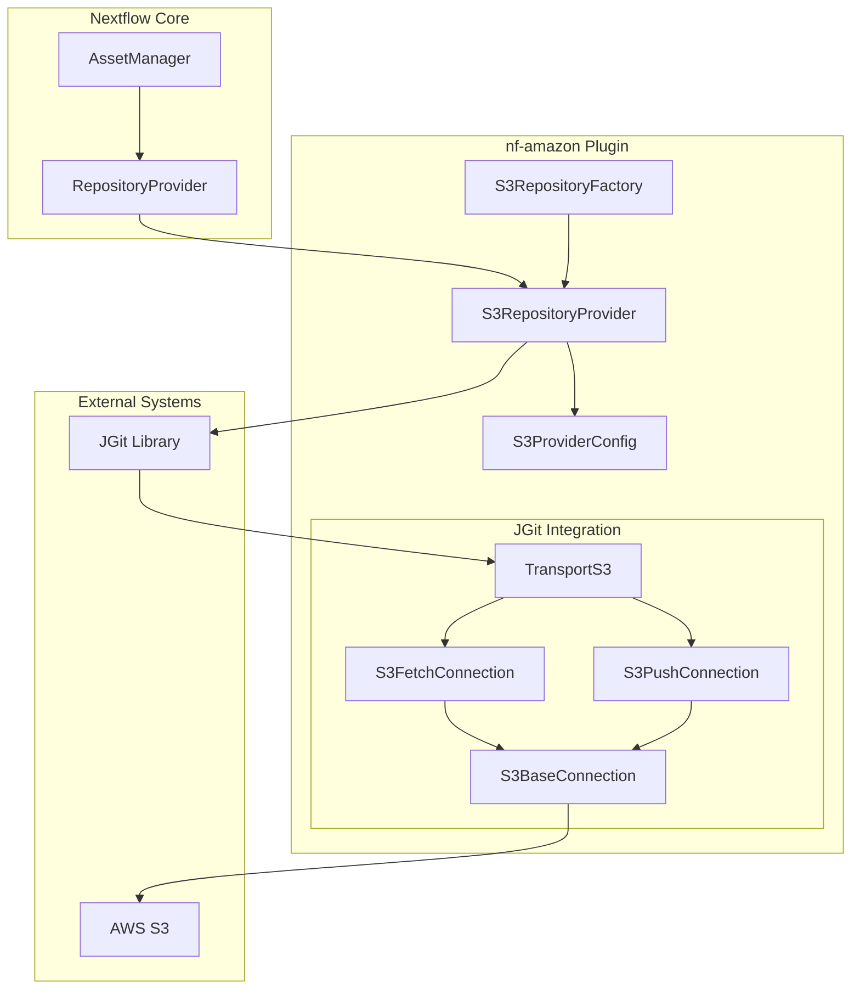
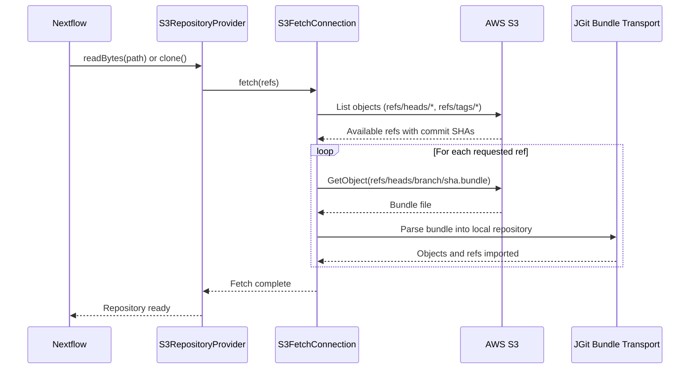
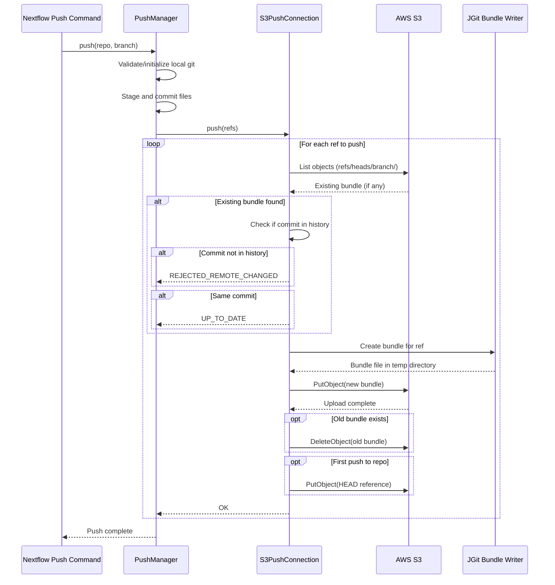

# S3 Git Repository Provider

- Authors: Jorge Ejarque
- Status: accepted
- Date: 2025-11-11
- Tags: scm, aws, s3, git, plugins

## Summary

Implements a Git repository provider that uses AWS S3 as a storage backend instead of traditional Git hosting services (GitHub, GitLab, etc.), enabling self-hosted workflow distribution without requiring dedicated Git server infrastructure.

## Problem Statement

Nextflow workflows are typically distributed through Git hosting platforms like GitHub, which require internet access, authentication management, and impose rate limits. Organizations seeking self-hosted alternatives must deploy and maintain dedicated Git servers (GitLab, Gitea, etc.).

The goal is to provide a lightweight alternative that leverages existing S3 infrastructure for workflow distribution, avoiding the operational complexity of Git server hosting while maintaining compatibility with Nextflow's Git-based asset management system. The solution must not depend on external tools or libraries that require separate installation or system-level configuration.

## Goals or Decision Drivers

- **Infrastructure Simplicity**: Leverage existing S3 buckets without additional server deployments
- **Standard Git Compatibility**: Support standard Git operations (clone, fetch, push) through JGit
- **AWS Integration**: Seamless integration with AWS credential management and IAM policies
- **Existing Architecture Compatibility**: Fit within Nextflow's RepositoryProvider abstraction
- **Performance**: Minimize unnecessary data transfer when fetching specific branches or files
- **Ephemeral Execution Support**: Remove friction for ephemeral tasks and pipeline executions with remote executors by eliminating dependencies on external Git hosting services
- **Access Constraints**: Provide a solution for users that are constrained on the use of public Git providers due to organizational policies, security requirements, or network restrictions

## Non-goals

- Supporting Git features beyond basic clone/fetch/push operations (no git-lfs, submodules, sparse checkout)
- Optimizing for repositories with hundreds of branches or very large commit histories
- Providing directory traversal API (listDirectory operation)
- Replacing traditional Git hosting for collaborative development workflows
- Replacing GitHub as the preferred Git provider for Nextflow pipelines - this solution is intended as an alternative for specific use cases, not as a general replacement for GitHub-based workflow distribution

## Considered Options

### Option 1: Standalone git-remote-helper

Implement a standalone git-remote-helper executable that git invokes for s3:// URLs.

- **Pro**: Standard Git integration pattern used by git-remote-s3, git-remote-gcrypt, etc.
- **Pro**: Works with any git client without code changes
- **Con**: Requires separate executable distribution and PATH management
- **Con**: Complex subprocess communication protocol between git and helper
- **Con**: Difficult integration with Nextflow's existing AWS credential management
- **Con**: Limited error handling and debugging capabilities

### Option 2: JGit Custom Transport Protocol

Extend JGit's Transport interface to implement S3 operations as a native transport protocol.

- **Pro**: Direct integration with Nextflow's existing JGit usage
- **Pro**: Unified credential management through AWS SDK
- **Pro**: Better error handling and debugging within the JVM
- **Pro**: No external dependencies or PATH configuration
- **Con**: Only works within JGit-based applications
- **Con**: Requires implementing low-level JGit transport interfaces

### Option 3: S3-backed Git Server

Deploy a lightweight HTTP server that translates Git smart protocol to S3 operations.

- **Pro**: Works with any git client
- **Pro**: Could support more advanced Git features
- **Con**: Requires server deployment and management
- **Con**: Defeats the purpose of avoiding Git server infrastructure
- **Con**: Additional complexity for authentication and authorization

## Solution

Implement a JGit custom transport protocol (Option 2) integrated as a plugin within the nf-amazon module.

## Rationale & Discussion

### Core Architecture Decision: JGit Transport Extension

The solution extends JGit's Transport abstraction by implementing:

- **TransportS3**: Custom transport protocol that registers the "s3://" scheme with JGit
- **S3FetchConnection**: Handles clone and fetch operations
- **S3PushConnection**: Handles push operations
- **S3BaseConnection**: Common functionality for ref management and S3 interactions



### Storage Model: Git Bundles on S3

**Key Decision**: Store each branch as a Git bundle file rather than individual Git objects.

**S3 Object Key Structure**:
```
bucket/
  repo-path/
    HEAD                              # Default branch reference
    refs/
      heads/
        main/
          <commit-sha>.bundle         # Bundle for main branch
        feature-x/
          <commit-sha>.bundle         # Bundle for feature-x branch
      tags/
        v1.0.0/
          <commit-sha>.bundle         # Bundle for tag v1.0.0
```

**Rationale**:
1. **S3 is Object Storage, not a Filesystem**: S3 lacks true directory semantics and atomic operations. Git's native format relies on filesystem assumptions that don't map well to S3.

2. **Atomic Branch Updates**: A single bundle file per branch provides atomic updates - either the old or new bundle exists, never a partially written state.

3. **Minimal Transfer for Single-Branch Operations**: Fetching a specific branch only requires downloading one bundle file, not the entire repository.

4. **Standard Git Format**: Bundles are a standard Git format that JGit handles natively, requiring minimal custom code.

### Fetch Operation Flow



**Key Implementation Details**:

1. **Ref Discovery**: Lists S3 objects under `refs/heads/` and `refs/tags/` prefixes to build the advertised refs map. The commit SHA is extracted from the bundle filename.

2. **Bundle Download**: Each requested branch's bundle is downloaded to a temporary directory.

3. **Bundle Import**: JGit's bundle transport imports the bundle into the local repository, handling all Git object parsing and ref updates.

4. **Default Branch Optimization**: When no revision is specified, only the default branch is fetched by querying the HEAD reference first, avoiding unnecessary branch downloads.

### Push Operation Flow



**Key Implementation Details**:

1. **Conflict Detection**: Before pushing, checks if the existing bundle's commit is an ancestor of the new commit. Rejects the push if it would create a non-fast-forward update.

2. **Bundle Generation**: Uses JGit's BundleWriter to create a complete bundle containing all objects reachable from the branch tip.

3. **Atomic Update**: Uploads the new bundle before deleting the old one, ensuring the branch is never in an invalid state visible to other clients.

4. **HEAD Management**: If no HEAD reference exists (first push to repo), creates one pointing to the pushed branch as the default.

### Authentication and Credentials

**Key Decision**: Use AWS SDK credential providers instead of Git username/password authentication.

The S3GitCredentialsProvider implements JGit's CredentialsProvider interface but bridges to AWS SDK credential resolution:

1. **Configuration Priority**:
   - Explicit `accessKey`/`secretKey` in SCM config
   - AWS profile specified in SCM config
   - Session-level AWS configuration
   - DefaultCredentialsProvider (environment variables, instance profiles, etc.)

2. **Region Resolution**:
   - Explicit region in SCM config
   - Session-level AWS configuration
   - DefaultAwsRegionProviderChain (environment, config files, instance metadata)

This approach provides seamless integration with existing AWS infrastructure while maintaining Nextflow's configuration patterns.

### Reflection-based Status Updates

**Technical Challenge**: JGit's RemoteRefUpdate class stores the push status in a package-private field without public setters. Custom transport implementations need to update this status to communicate results.

**Solution**: Use reflection to access and modify the status field.

**Rationale**:
1. **JAR Signing Restrictions**: JGit's JAR is signed, preventing custom classes from being placed in the org.eclipse.jgit.transport package where they would have package-private access.

2. **No Public API**: JGit provides no public API for transport implementations to set push status.

3. **Essential Functionality**: Without status updates, push operations cannot communicate success/failure/rejection to callers.

4. **Stability**: The RemoteRefUpdate.status field has been stable across JGit versions, minimizing fragility risk.

### Limitations and Trade-offs

**Unsupported Operations**:
- **Directory Traversal**: The `listDirectory` method throws UnsupportedOperationException because it would require cloning the entire repository just to list files.

**Performance Characteristics**:
- **Single-File Access**: Reading a single file requires downloading and unpacking the entire branch bundle. Optimized by only fetching the default branch when no revision is specified.

- **Multiple Branches**: Fetching multiple branches requires downloading one bundle per branch. More efficient than traditional Git for repositories with many branches when only a few are needed.

- **Large Histories**: Bundle size grows with commit history. Works well for typical workflow repositories (dozens to hundreds of commits) but not suitable for repositories with thousands of commits per branch.

**Operational Considerations**:
- **S3 Consistency**: Relies on S3's strong read-after-write consistency for new objects.
- **Concurrent Pushes**: No distributed locking mechanism. Concurrent pushes to the same branch may result in one being rejected (similar to traditional Git).
- **Storage Costs**: Each branch update creates a new bundle file. Old bundles are deleted immediately, so storage cost is proportional to the number of active branches, not the update frequency.

## Consequences

### Positive

- **Zero Server Infrastructure**: Organizations can distribute workflows using existing S3 buckets without deploying Git servers
- **IAM Integration**: Leverages AWS IAM for access control rather than managing separate Git authentication
- **Transparent Integration**: Works seamlessly with existing Nextflow commands (pull, run, push)
- **Plugin Architecture**: Isolated in nf-amazon plugin, optional for users not needing this functionality
- **Selective Branch Fetch**: Only downloads requested branches, efficient for repositories with many branches

### Negative

- **Bundle Overhead**: Each fetch downloads the complete branch history even for single-file access
- **JGit Dependency**: Solution is specific to JGit and doesn't benefit non-Nextflow Git clients
- **Limited Git Features**: No support for advanced Git operations (partial clone, shallow fetch, etc.)
- **Directory Traversal**: Cannot list repository contents without cloning
- **Reflection Fragility**: Status update mechanism depends on JGit internal implementation details

### Neutral

- **Storage Format Compatibility**: Uses git-remote-s3 compatible storage format, but this is an implementation detail rather than a requirement
- **AWS-Specific**: Only works with AWS S3, not other S3-compatible services (MinIO, etc.) unless they provide compatible APIs
- **Credential Complexity**: Configuration requires understanding AWS credential chain, which may be unfamiliar to some users

## Implementation Notes

### Plugin Registration

The S3RepositoryFactory uses @Priority(-10) to ensure it's checked after standard providers, preventing conflicts with other repository types.

The TransportS3 protocol is registered lazily on first use via an AtomicBoolean guard, ensuring the JGit transport registry is extended exactly once.

### Error Handling

- **Missing Bundles**: Treated as transport errors with descriptive messages
- **Multiple Bundles**: Protected against by implementation (should never occur) but explicitly checked and rejected
- **Invalid Refs**: Gracefully handled by returning empty ref lists for missing heads/tags

### New Commands

Introduces `nextflow push` command to upload local directories to S3-backed Git repositories, with options for:
- Automatic git initialization and commit
- Branch specification
- File size validation
- .gitignore management

## Links

- Git Bundle Format: https://git-scm.com/docs/git-bundle
- JGit Transport API: https://wiki.eclipse.org/JGit/User_Guide#Transports
- git-remote-s3 project: https://github.com/bgahagan/git-remote-s3 (inspiration for storage format)

## More Information

This implementation enables workflow distribution patterns such as:
- Private workflow libraries within AWS organizations
- Air-gapped environments with S3-compatible storage
- Cost-effective alternatives to GitHub private repositories
- Integration with existing S3 bucket policies and lifecycle rules