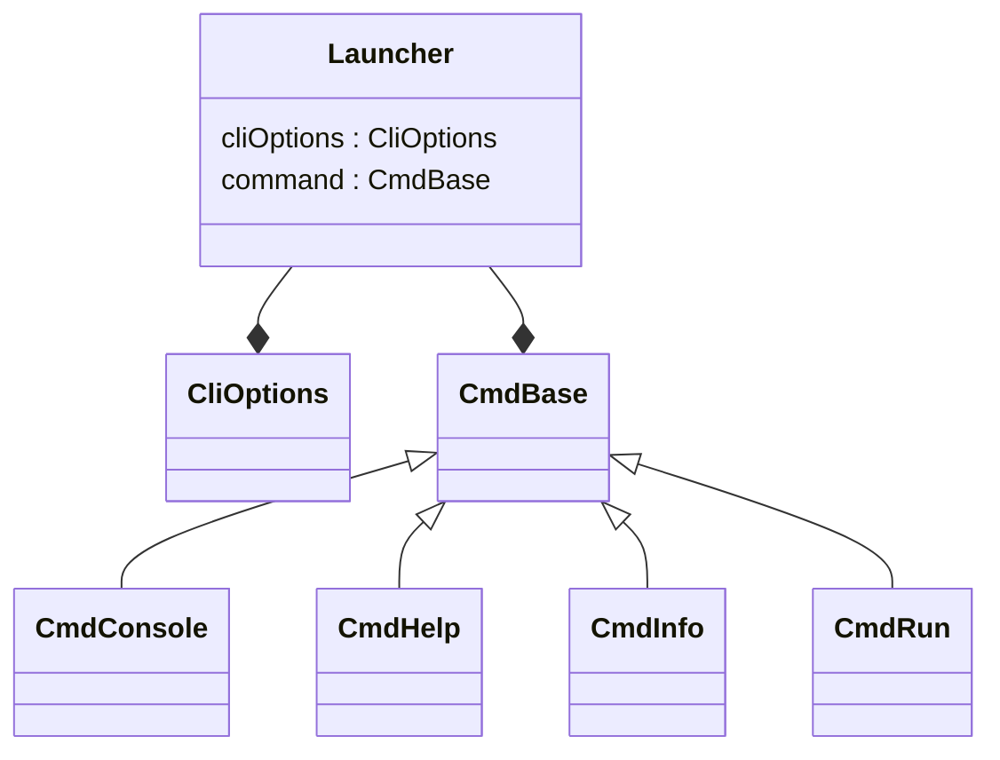

# `nextflow.cli`

The `nextflow.cli` package implements the command line interface.

## Class Diagram

:::note
Some classes may be excluded from the above diagram for brevity.
:::

## Notes

The `Launcher` class is the entrypoint for Nextflow. It uses [JCommander](https://jcommander.org/) to parse the command-line arguments. Additionally, there is a class for each subcommand which implements the application logic of that command. By far the most complex command is `CmdRun`.
