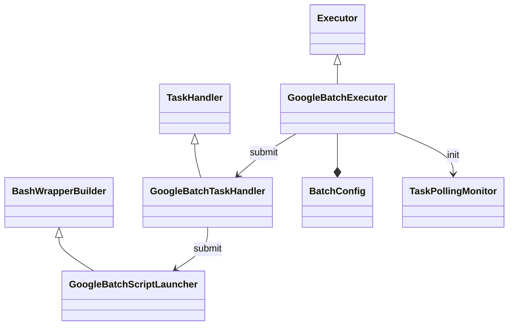

# `nextflow.cloud.google`

The `nextflow.cloud.google` package implements the Google Batch executor.

## Class Diagram

```mermaid
classDiagram
    %%
    %% nextflow.cloud.google
    %%
    Executor <|-- GoogleBatchExecutor
    TaskHandler <|-- GoogleBatchTaskHandler
    BashWrapperBuilder <|-- GoogleBatchScriptLauncher

    GoogleBatchExecutor --* BatchConfig

    GoogleBatchExecutor --> TaskPollingMonitor : init
    GoogleBatchExecutor --> GoogleBatchTaskHandler : submit
    GoogleBatchTaskHandler --> GoogleBatchScriptLauncher : submit

```

:::note
Some classes may be excluded from the above diagram for brevity.
:::
