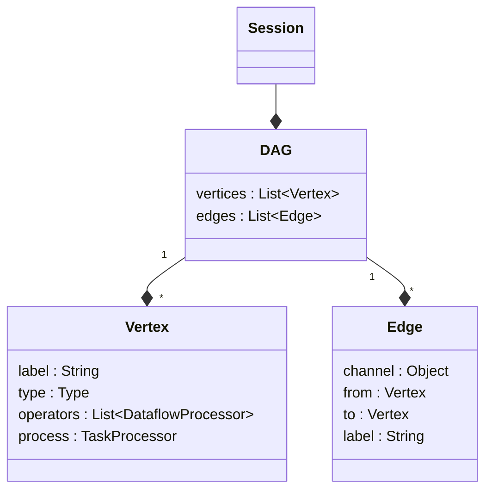

# `nextflow.dag`

The `nextflow.dag` package implements the workflow DAG and renderers for several diagram formats.

## Class Diagram

:::note
Some classes may be excluded from the above diagram for brevity.
:::

## Notes

The workflow DAG defines the network of processes, channels, and operators that comprise a workflow. It is produced by the execution of the Nextflow script. See [nextflow.script][nextflow-script] for more details.

Implementations of the `DagRenderer` interface define how to render the workflow DAG to a particular diagram format. See [Workflow diagram][workflow-diagram] for more details.

[nextflow-script]: /nextflow_docs/nextflow_repo/docs/developer/nextflow.script.mdx
[workflow-diagram]: /nextflow_docs/nextflow_repo/docs/reports.mdx#workflow-diagram
