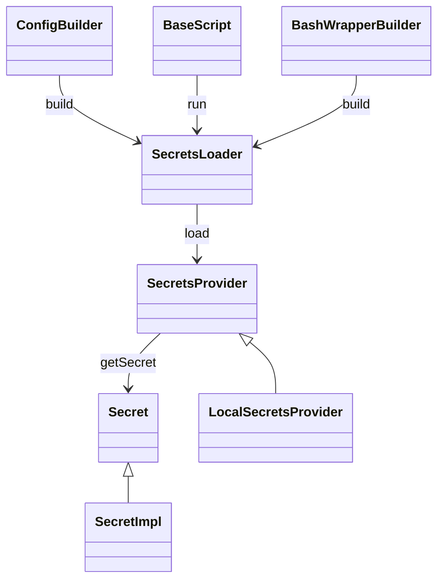

# `nextflow.secret`

The `nextflow.secret` package defines the secrets provider interface and implements the built-in local secrets store.

## Class Diagram

:::note
Some classes may be excluded from the above diagram for brevity.
:::

## Notes

The default secrets provider simply stores key-value pairs in a local JSON file.
