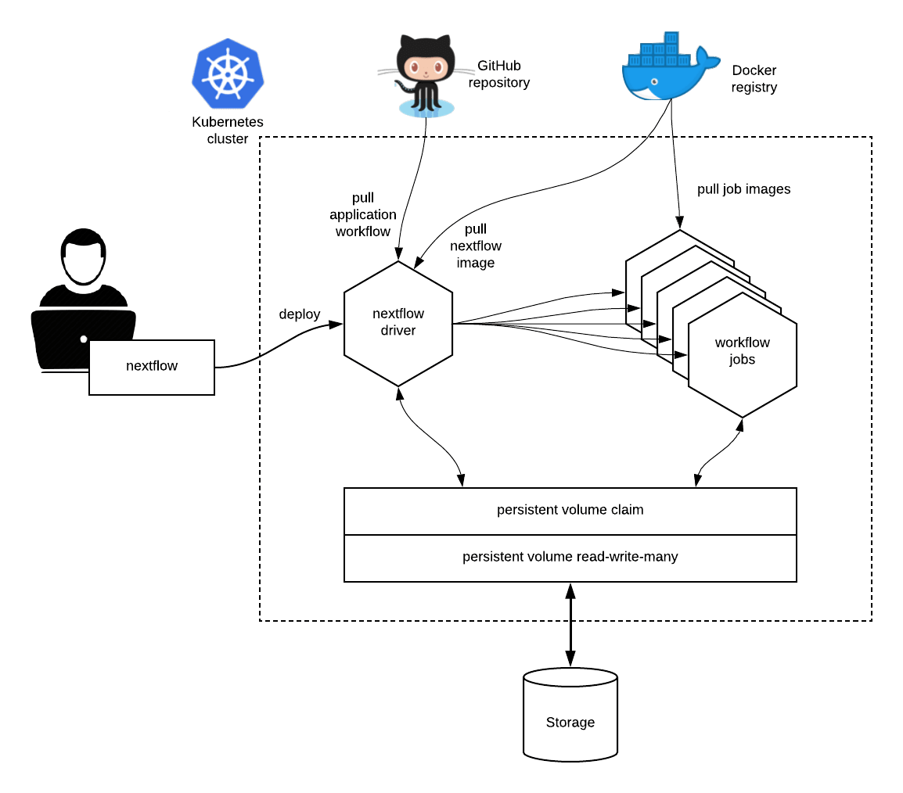

.. _k8s-page:

**********
Kubernetes
**********

`Kubernetes <https://kubernetes.io/>`_ is a cloud-native open-source system for deployment, scaling, and management of
containerized applications.

It provides clustering and file system abstractions that allows the execution of containerised workloads across
different cloud platforms and on-premises installations.

The built-in support for Kubernetes provided by Nextflow streamlines the execution of containerised workflows in
Kubernetes clusters.

Concepts
========

Kubernetes main abstraction is the `pod`. A `pod` defines the (desired) state of one or more containers i.e. required
computing resources, storage, network configuration.

Kubernetes abstracts also the storage provisioning through the definition of one more persistent volumes that
allow containers to access to the underlying storage systems in a transparent and portable manner.

When using the ``k8s`` executor Nextflow deploys the workflow execution as a Kubernetes pod. This pod orchestrates
the workflow execution and submits a separate pod execution for each job that need to be carried out by the workflow
application.

Requirements
============

At least a `Persistent Volume <https://kubernetes.io/docs/concepts/storage/persistent-volumes/#persistent-volumes>`_ with
``ReadWriteMany`` access mode has to be defined in the Kubernetes cluster (check the supported storage systems
at `this link <https://kubernetes.io/docs/concepts/storage/persistent-volumes/#access-modes>`_).

Such volume needs to be accessible through a
`Persistent Volume Claim <https://kubernetes.io/docs/concepts/storage/persistent-volumes/#persistentvolumeclaims>`_, which
will be used by Nextflow to run the application and store the scratch data and the pipeline final result.

The workflow application has to be containerised using the usual Nextflow :ref:`container<process-container>` directive.

.. tip::
  When using :ref:`wave-page` and :ref:`fusion-page` there is no need to use a shared file system and configure
  a persistent volume claim for the deployment of Nextflow pipeline with Kubernetes.
  You can ignore this requirement when using the Fusion file system feature. See the :ref:`fusion-page` documentation
  for further details.

Execution
=========

The workflow execution needs to be submitted from a computer able to connect to the Kubernetes cluster.

Nextflow uses the Kubernetes configuration file available at the path ``$HOME/.kube/config`` or the file specified
by the environment variable ``KUBECONFIG``.

You can verify such configuration with the command below::

    $ kubectl cluster-info
    Kubernetes master is running at https://your-host:6443
    KubeDNS is running at https://your-host:6443/api/v1/namespaces/kube-system/services/kube-dns:dns/proxy

Launch with ``kuberun``
-----------------------

To deploy and launch the workflow execution use the Nextflow command ``kuberun`` as shown below::

    nextflow kuberun <pipeline-name> -v vol-claim:/mount/path

This command will create and execute a pod running the nextflow orchestrator for the specified workflow.
In the above example replace ``<pipeline-name>`` with an existing nextflow project or the absolute path
of a workflow already deployed in the Kubernetes cluster.

The ``-v`` command line option is required to specify the volume claim name and mount path to use for the workflow
execution. In the above example replace ``vol-claim`` with the name of an existing persistent volume claim and
``/mount/path`` with the path where the volume is required to be mount in the container. Volume claims can also be
specified in the Nextflow configuration file, see the :ref:`Kubernetes configuration section<config-k8s>` for details.

Once the pod execution starts, the application in the foreground prints the console output produced by the running
workflow pod.

.. warning::
  The ``kuberun`` is considered an obsolete approach for the deployment of Nextflow pipeline with Kubernetes and
  it's not maintained anymore. Consider the use of `Launch with Fusion`_ as a better alternative.

Interactive login
-----------------

For debugging purpose it's possible to execute a Nextflow pod and launch an interactive shell using the following command::

   nextflow kuberun login -v vol-claim:/mount/path

This command creates a pod, sets up the volume claim(s), configures the Nextflow environment and finally launches a Bash
login session.

.. warning:: The pod is automatically destroyed once the shell session terminates. Do not use to start long running
  workflow executions in background.

Launch with Fusion
------------------

The use of :ref:`fusion-page` allows deploying a Nextflow pipeline to a remote (or local) cluster without
the need to use a shared file system and configure a persistent volume claim for the deployment of Nextflow
pipeline with Kubernetes.

This also makes unnecessary the use of the special ``kuberun`` command for the pipeline execution.

For this deployment scenario the following configuration can be used::

    wave {
      enabled = true
    }

    fusion {
      enabled = true
    }

    process {
      executor = 'k8s'
    }

    k8s {
      context = '<YOUR K8S CONFIGURATION CONTEXT>'
      namespace = '<YOUR K8S NAMESPACE>'
      serviceAccount = '<YOUR K8S SERVICE ACCOUNT>'
    }

The ``k8s.context`` represents the Kubernetes configuration context to be used for the pipeline execution. This
setting can be omitted if Nextflow itself is run as a pod in the Kubernetes clusters.

The ``k8s.namespace`` represents the Kubernetes namespace where the jobs submitted by the pipeline execution should
be executed.

The ``k8s.serviceAccount`` represents the Kubernetes service account that should be used to grant the execution
permission to jobs launched by Nextflow. You can find more details how to configure it as the `following link <https://github.com/seqeralabs/wave-showcase/tree/master/example8>`_.

Then the pipeline execution can be launched using the usual run command and specifying a AWS S3 bucket work directory,
for example::

    nextflow run <YOUR PIPELINE> -work-dir s3://<YOUR-BUCKET>/scratch

Running in a pod
----------------

Nextflow can be executed directly from a pod running in a
Kubernetes cluster. In these cases you will need to use the plain Nextflow ``run`` command and specify
the ``k8s`` executor and the required persistent volume claim in the ``nextflow.config`` file as shown below::

    process {
       executor = 'k8s'
    }

    k8s {
       storageClaimName = 'vol-claim'
       storageMountPath = '/mount/path'
       storageSubPath = '/my-data'
    }

In the above snippet replace ``vol-claim`` with the name of an existing persistent volume claim and replace
``/mount/path`` with the actual desired mount path (default: ``/workspace``) and ``storageSubPath``
with the directory in the volume to be mounted (default: ``/``).

.. warning:: The running pod must have been created with the same persistent volume claim name and mount as the
    one specified in your Nextflow configuration file.
    Note also that the ``run`` command does not support the ``-v`` option.

.. tip:: It is also possible to mount multiple volumes using the ``pod`` directive, setting such as ``k8s.pod = [ [volumeClaim: "other-pvc", mountPath: "/other" ]]``

Pod settings
============

The process :ref:`process-pod` directive allows the definition of pods specific settings, such as environment variables,
secrets and config maps when using the :ref:`k8s-executor` executor. See the :ref:`process-pod` directive for more details.

Limitation
==========

.. note::
  The ``kuberun`` command does not allow the execution of local Nextflow scripts and it's has been designed to
  provide a shortcut to simple pipeline deployment into a Kubernetes cluster.

  For stable pipeline deployment, Nextflow needs to be executed as a pod as mentioned in the `Running in a pod`_ section.
  In alternative take in consideration a managed provisioning service such as `Nextflow Tower <https://tower.nf>`_.

Advanced configuration
======================

Read :ref:`Kubernetes configuration<config-k8s>` and :ref:`executor <k8s-executor>` sections to learn more
about advanced configuration options.
