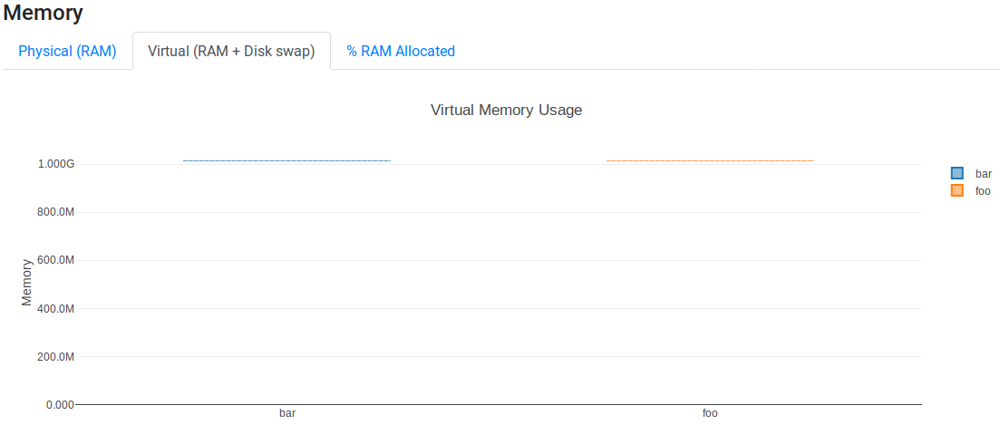
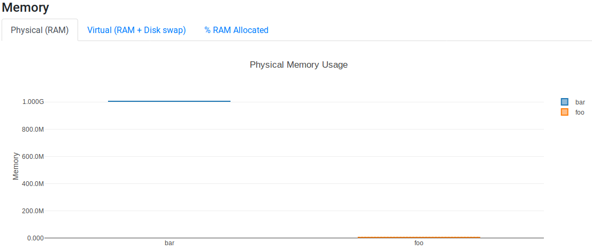
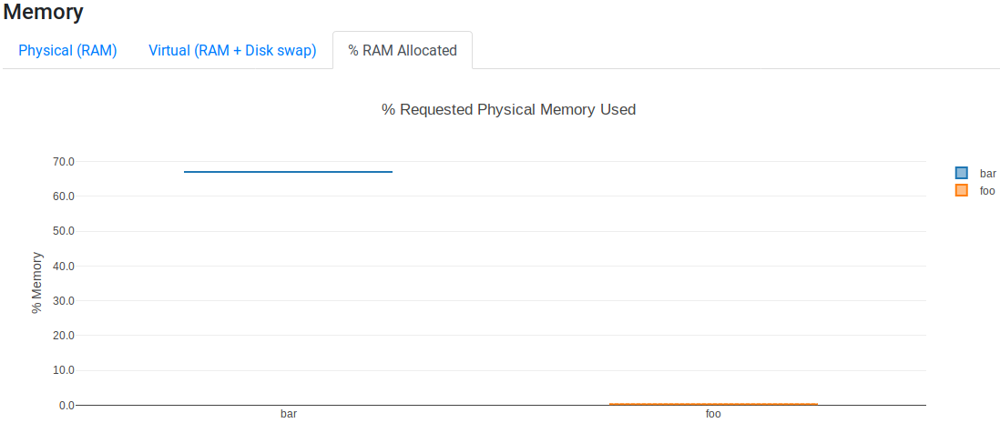

.. _metrics-page:

***********************
Metrics
***********************

This section details how the resource usage from the :ref:`Execution report <execution-report>` are computed.

CPU Usage
=========

The plot reports how much CPU resources were used by each process.

.. image:: images/report-resource-cpu.png

Let's illustrate how this plot behaves with several examples.

In the first example, let's consider the simple use case in which a process performs one task of pure computation using one CPU. Then, you expect the `Raw Usage` tab to report 100%. If the task is distributed over, 2, 3, 4, `etc.` CPUs, then the `Raw Usage` will be 200%, 300%, 400%, `etc.` respectively. The `% Allocated` tab just rescales the raw value usage with respect to the number of CPUs set with the ``cpus`` directive (if not set with the directive, the number of CPUs is set to 1, thus showing the same values as in the `Raw Usage` tab). Using the program `stress <https://people.seas.harvard.edu/~apw/stress/>`_  as follows would report 100% in the `Raw Usage` tab  and 50% in the `% Allocated` tab since the process asked twice the number of CPUs needed by the process::

  #!/usr/bin/env nextflow

  process CpuUsageEx1 {
    
    cpus 2

    """
    stress -c 1 -t 10 # compute square-root of random numbers during 10s using 1 CPU
    """
  }

In the second example, some time will be spent performing pure computation and some time just waiting. Using the program `stress <https://people.seas.harvard.edu/~apw/stress/>`_  and `sleep` as follows would report 75% in the `Raw Usage` tab::

  #!/usr/bin/env nextflow

  process CpuUsageEx2 {
    
    cpus 1

    """
    stress -c 1 -t 10 # compute square-root of random numbers during 10s using 1 CPU
    stress -c 1 -t 5 # compute square-root of random numbers during 5s using 1 CPU
    sleep 5 # use no CPU during 5s
    """
  }

Indeed, the percentage of the CPU that this process got is a weighted average taking into account the percentage of the CPU and duration of each individual program over the job duration (`aka` elapsed real time, real time or wall time ) as follows:

.. math::
  \frac{ 100\% \times 10s + 100\% \times 5s + 0\% \times 5s }{10s+5s+5s} = 75\%

The third example is similar to the second one except that the pure computation stage is performed in a single step forked on 2 CPUs::

  #!/usr/bin/env nextflow

  process CpuUsageEx3 {
    
    cpus 2

    """
    stress -c 2 -t 10 # compute square-root of random numbers during 10s using 2 CPUs
    sleep 10 # use no CPU during 10s
    """
  }

The `Raw Usage` tab would report 100% in the `Raw Usage` tab:

.. math::
  \frac{ 200\% \times 10s }{10s+10s} = 100\%

The `% Allocated` tab would report 50%, however, it would not be relevant to change the ``cpus`` directive from 2 to 1 as the process really uses 2 CPUs at it peak load.

.. hint:: The `stress <https://people.seas.harvard.edu/~apw/stress/>`_ program can be installed with ``sudo apt-get install stress`` or ``sudo yum install stress`` depending on your linux distribution.

Memory Usage
============

The plot has three tabs showing the usage of the physical memory (RAM), the virtual memory (vmem) and the percentage of RAM used by the process with respect to what was set in the ``memory`` directive. The peak usage during the execution of the process is reported for both physical and virtual memories.

.. hint::
  To better understand the memory usage plot, it is important to know that:

  - the total amount of memory used be a processs is the `virtual memory (vmem)`. The `vmem` contains all memory areas whether they are in the physical memory (RAM), in the Swap space, on the disk or shared with other processes,
  - the `resident set size (RSS)` is the amount of space of `physical memory (RAM)` held by a process,
  - the relationship is: vmem :math:`\geq` RSS + Swap,
  - the ``memory`` directive sets the RAM requested by the process.

Let's illustrate how this plot behaves with one example which relies on two C programs `memory-vmem_1GiB_ram_0Gib` and `memory-vmem_1GiB_ram_1Gib`. 

The first program `memory-vmem_1GiB_ram_0Gib` just allocates a variable of 1GiB **but does not use it**:

.. literalinclude:: doctests/memory-vmem_1GiB_ram_0Gib.c
   :language: c
   :emphasize-lines: 32,44

The second program `memory-vmem_1GiB_ram_1Gib` allocates a variable of 1GiB and **fills it with data**:

.. literalinclude:: doctests/memory-vmem_1GiB_ram_1Gib.c
   :language: c
   :emphasize-lines: 32,44,50-54

The two programs are exectuted in the following nextflow script::

  #!/usr/bin/env nextflow

  process vmem_1GiB_ram_0Gib {
  
      memory '1.5 GB'
  
      """
      memory_vmem_1GiB_ram_0Gib
      """

  }

  process vmem_1GiB_ram_1Gib {

      memory '1.5 GB'

      """
      memory_vmem1GiB_ram_1Gib
      """

  }

The `Virtual (RAM + Disk swap)` tab shows that both `vmem_1GiB_ram_0Gib` and `vmem_1GiB_ram_1Gib` processes use the same amount of virtual memory (~1GiB):

However, the `Virtual (RAM)` tab shows that only the `vmem_1GiB_ram_1Gib` process uses ~1GiB of RAM while `vmem_1GiB_ram_0Gib` process uses  ~0GiB:

As expected, the `% RAM Allocated` tab shows that ~0% of the resource set in the ``memory`` directive was used for `vmem_1GiB_ram_0Gib` process while ~67% (= 1 / 1.5) of the resource were used for `vmem_1GiB_ram_0Gib` process:

.. warning:: Binary unit are used to report memory raw values. This means that 1KB = :math:`1024` bytes, 1MB = :math:`1024^2` bytes, 1GB = :math:`1024^3` bytes, `etc.`

Job Duration
============

The plot has two tabs the job duration (`aka` elapsed real time, real time or wall time ) in the `Raw Usage` tag and the percentage  of requested time used in the `% Allocated` tab with respect to the duration set in the ``time`` directive of the process.

I/O
===

The plot has two tabs showing how many data were read and/or written each process. For example, the following processes read and write 1GB and 256MB of data respectively::

  #!/usr/bin/env nextflow

    process io_read_write_1G {
      """
      dd if=/dev/zero of=/dev/null bs=1G count=1
      """
    }

    process io_read_write_256M {
      """
      dd if=/dev/zero of=/dev/null bs=256M count=1
      """
    }

`Read` tab:

.. image:: images/report-resource-io-read.png

`Write` tab:

