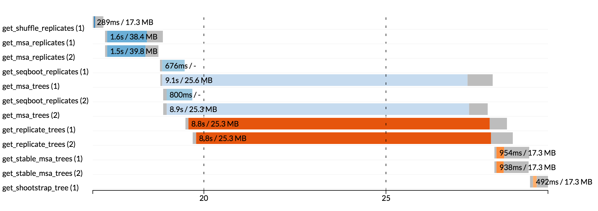

.. _perfanalysis-page:

***********************
Tracing & visualisation
***********************

Nextflow can produce an execution tracing report that provides some information for a basic performance analysis
of a pipeline execution. A more advanced analysis is possible by using the `Extrae` and `Paraver` tools integrated with Nextflow.

.. _trace-report:

Execution report
================

Nextflow creates an execution tracing file that contains some useful information about each process executed in your pipeline
script, including: submission time, start time, completion time, cpu and memory used.

.. warning:: This is an incubating feature. It may change in future Nextflow releases.

In order to create the execution trace file add the ``-with-trace`` command line option when launching the pipeline execution.
For example::

  nextflow run <pipeline name> -with-trace

It will create a file named ``trace.txt`` in the current directory. The content looks like the above example:

======= ========= ========= =============== =========== ======== ======================= =========== =========== ======= =========== =========== =========== ===========
task_id hash      native_id   name          status      exit     submit                  duration    walltime    %cpu    rss         vmem        rchar       wchar
======= ========= ========= =============== =========== ======== ======================= =========== =========== ======= =========== =========== =========== ===========
19      45/ab752a 2032      blast (1)       COMPLETED   0        2014-10-23 16:33:16.288 1m          5s          0.0%    29.8 MB     354 MB      33.3 MB     0
20      72/db873d 2033      blast (2)       COMPLETED   0        2014-10-23 16:34:17.211 30s         10s         35.7%   152.8 MB    428.1 MB    192.7 MB    1 MB
21      53/d13188 2034      blast (3)       COMPLETED   0        2014-10-23 16:34:17.518 29s         20s         4.5%    289.5 MB    381.6 MB    33.3 MB     0
22      26/f65116 2035      blast (4)       COMPLETED   0        2014-10-23 16:34:18.459 30s         9s          6.0%    122.8 MB    353.4 MB    33.3 MB     0
23      88/bc00e4 2036      blast (5)       COMPLETED   0        2014-10-23 16:34:18.507 30s         19s         5.0%    195 MB      395.8 MB    65.3 MB     121 KB
24      74/2556e9 2037      blast (6)       COMPLETED   0        2014-10-23 16:34:18.553 30s         12s         43.6%   140.7 MB    432.2 MB    192.7 MB    182.7 MB
28      b4/0f9613 2041      exonerate (1)   COMPLETED   0        2014-10-23 16:38:19.657 1m 30s      1m 11s      94.3%   611.6 MB    693.8 MB    961.2 GB    6.1 GB
32      af/7f2f57 2044      exonerate (4)   COMPLETED   0        2014-10-23 16:46:50.902 1m 1s       38s         36.6%   115.8 MB    167.8 MB    364 GB      5.1 GB
33      37/ab1fcc 2045      exonerate (5)   COMPLETED   0        2014-10-23 16:47:51.625 30s         12s         59.6%   696 MB      734.6 MB    354.3 GB    420.4 MB
31      d7/eabe51 2042      exonerate (3)   COMPLETED   0        2014-10-23 16:45:50.846 3m 1s       2m 6s       130.1%  703.3 MB    760.9 MB    1.1 TB      28.6 GB
36      c4/d6cc15 2048      exonerate (6)   COMPLETED   0        2014-10-23 16:48:48.718 3m 1s       2m 43s      116.6%  682.1 MB    743.6 MB    868.5 GB    42 GB
30      4f/1ad1f0 2043      exonerate (2)   COMPLETED   0        2014-10-23 16:45:50.961 10m 2s      9m 16s      95.5%   706.2 MB    764 MB      1.6 TB      172.4 GB
52      72/41d0c6 2055      similarity (1)  COMPLETED   0        2014-10-23 17:13:23.543 30s         352ms       0.0%    35.6 MB     58.3 MB     199.3 MB    7.9 MB
57      9b/111b5e 2058      similarity (6)  COMPLETED   0        2014-10-23 17:13:23.655 30s         488ms       0.0%    108.2 MB    158 MB      317.1 MB    9.8 MB
53      3e/bca30f 2061      similarity (2)  COMPLETED   0        2014-10-23 17:13:23.770 30s         238ms       0.0%    6.7 MB      29.6 MB     190 MB      91.2 MB
54      8b/d45b47 2062      similarity (3)  COMPLETED   0        2014-10-23 17:13:23.808 30s         442ms       0.0%    108.1 MB    158 MB      832 MB      565.6 MB
55      51/ac19c6 2064      similarity (4)  COMPLETED   0        2014-10-23 17:13:23.873 30s         6s          0.0%    112.7 MB    162.8 MB    4.9 GB      3.9 GB
56      c3/ec5f4a 2066      similarity (5)  COMPLETED   0        2014-10-23 17:13:23.948 30s         616ms       0.0%    10.4 MB     34.6 MB     238 MB      8.4 MB
98      de/d6c0a6 2099      matrix (1)      COMPLETED   0        2014-10-23 17:14:27.139 30s         1s          0.0%    4.8 MB      42 MB       240.6 MB    79 KB
======= ========= ========= =============== =========== ======== ======================= =========== =========== ======= =========== =========== =========== ===========

.. _trace-fields:

The following table shows the fields that can be included in the execution report:

======================= ===============
Name                    Description
======================= ===============
task_id                 Task ID.
hash                    Task hash code.
native_id               Task ID given by the underlying execution system e.g. POSIX process PID when executed locally, job ID when executed by a grid engine, etc.
process                 Nextflow process name.
tag                     User provided identifier associated this task.
name                    Task name.
status                  Task status.
exit                    POSIX process exit status.
module                  Environment module used to run the task.
container               Docker image name used to execute the task.
attempt                 Attempt at which the task completed.
submit                  Timestamp when the task has been submitted.
start                   Timestamp when the task execution has started.
complete                Timestamp when task execution has completed.
duration                Time elapsed to complete since the submission.
realtime                Task execution time i.e. delta between completion and start timestamp.
%cpu                    Percentage of CPU used by the process.
%mem                    Percentage of memory used by the process.
rss                     Real memory (resident set) size of the process. Equivalent to ``ps -o rss`` .
vmem                    Virtual memory size of the process. Equivalent to ``ps -o vsize`` .
:sup:`*` peak_rss       Peak of real memory. This data is read from field ``VmHWM`` in ``/proc/$pid/status`` file.
:sup:`*` peak_vmem      Peak of virtual memory. This data is read from field ``VmPeak`` in ``/proc/$pid/status`` file.
:sup:`*` rchar          Number of bytes the process read, using any read-like system call from files, pipes, tty, etc. This data is read from file ``/proc/$pid/io``.
:sup:`*` wchar          Number of bytes the process wrote, using any write-like system call. This data is read from file ``/proc/$pid/io``.
:sup:`*` syscr          Number of read-like system call invocations that the process performed. This data is read from file ``/proc/$pid/io``.
:sup:`*` syscw          Number of write-like system call invocations that the process performed. This data is read from file ``/proc/$pid/io``.
:sup:`*` read_bytes     Number of bytes the process directly read from disk. This data is read from file ``/proc/$pid/io``.
:sup:`*` write_bytes    Number of bytes the process originally dirtied in the page-cache (assuming they will go to disk later). This data is read from file ``/proc/$pid/io``.
======================= ===============

.. note:: Fields marked with (*) are not available when running the tracing on Mac OSX. Also note that the Mac OSX default ``date`` utility,
  has a time resolution limited to seconds. For a more detailed time tracing it is suggested to install
  `GNU coreutils <http://www.gnu.org/software/coreutils/>`_ package that includes the standard one.

.. warning:: These numbers provide an estimation of the resources used by running tasks. They should not be intended as an alternative
  to low level performance analysis provided by other tools and they may not be fully accurate, in particular for very short tasks
  (taking less than one minute).

Trace report layout and other configuration settings can be specified by using the ``nextflow.config`` configuration file.

Please read :ref:`Trace scope <config-trace>` section to learn more about it.

Timeline report
===============

Nextflow can render an HTML timeline for all processes executed in your pipeline. An example of the timeline
report is shown below:

Each bar represents a process run in the pipeline execution. The bar length represents the task duration time (wall-time).
The colored area in each bar represents the real execution time. The grey area to the *left* of the colored area represents
the task scheduling wait time. The grey area to the *right* of the colored area represents the task termination time
(clean-up and file un-staging).

Each bar displays two numbers: the task duration time and the virtual memory size peak.

As each process can spawn many tasks, colors are used to identify those tasks belonging to the same process.

To enable the creation of the timeline report add the ``-with-timeline`` command line option when launching the pipeline
execution. For example::

  nextflow run <pipeline name> -with-timeline [file name]

The report file name can be specified as an optional parameter following the timeline option.

DAG visualisation
=================

A Nextflow pipeline is implicitly modelled by a direct acyclic graph (DAG). The vertices in the graph represent
the pipeline's processes and operators, while the edges represent the data connections (i.e. channels) between them.

The pipeline execution DAG can be outputted by adding the ``-with-dag`` option to the run command line.
It creates a file named ``dag.dot`` containing a textual representation of the pipeline execution graph
in the `DOT format <http://www.graphviz.org/content/dot-language>`_.

The execution DAG can be rendered in a different format by specifying an output file name which has an extension
corresponding to the required format. For example::

    nextflow run <script-name> -with-dag flowchart.png

List of supported file formats:

============ ====================
Extension     File format
============ ====================
dot           Graphviz DOT file
html          HTML file
pdf           PDF file (*)
png           PNG file (*)
svg           SVG file (*)
============ ====================

.. warning:: The file formats marked with a `*` require the `Graphviz <http://www.graphviz.org>`_ tool installed
  in your computer.

The DAG produced by Nextflow for the `Shootstrap <https://github.com/cbcrg/shootstrap/>`_ pipeline:

.. image:: images/dag.png

Extrae integration
==================

Nextflow integrates the support for `Extrae`_ a library for performance tracing. Trace files
created by Extrae can be analysed with `Paraver`_, a visual performance analysis tool.

*Extrae* together with *Paraver* will allows you to analyse the execution performance of your
pipeline.

.. note:: Both *Extrae* and *Paraver* are tools developed by the `Barcelona Supercomputing Center`_.

How to use it
---------------

This feature currently depends on a custom version of Extrae 2.5.0 that needs to be installed in
the computer where the pipeline is executed.

.. warning:: This is an incubating feature. It may change in future Nextflow releases.

Pre-requisite
---------------

* Install ``libxml2``
* Install ``binutils``

If you are using an Ubuntu Linux distribution these packages can be installed using the following
commands::

    sudo apt-get install libxml2-dev binutils-dev

It may change depending your Linux distribution and the available package installer tool.

Installation
------------

Download the Extrae 2.5.0 at this link http://www.nextflow.io/misc/extrae-2.5.0.tar.gz

Compile and install it by using the following command::

  ./configure \
   --without-mpi \
   --without-unwind \
   --without-dyninst \
   --without-papi \
   --without-java \
   --prefix=<extrae_install_dir>

  make
  make install

When the compilation process is completed define the following variables in your
environment profile file::

  export EXTRAE_HOME=<extrae_install_dir>
  export LD_LIBRARY_PATH=${LD_LIBRARY_PATH}:${EXTRAE_HOME}/lib

Profile your pipeline
---------------------

In order to use the Extrae tracing simply add the option ``-with-extrae`` to your Nextflow
launch command line, for example::

  nextflow run <your pipeline> -with-extrae

When the pipeline execution completes, other then the expected result files, it will produce the Extrae
trace file having the following name: ``TRACE.mpits``

Converts this file to the Paraver format by using the following command::

  ${EXTRAE_HOME}/bin/mpi2prv -task-view -f TRACE.mpits -o <your file name>.prv

Analysis with Paraver
---------------------

If do not have Paraver installed, you need to download and install it in your computer.
You can download it from this page: http://www.bsc.es/performance_tools/downloads

Use the ``File > Load Trace`` command in the Paraver menu to load the trace file
(the file with ``.prv`` suffix).

To perform a basic analysis download the `configuration file available
at this link <http://www.nextflow.io/misc/nextflow_runtime_analysis.cfg>`_ and open it
by using the command ``File -> Load Configuration`` in the Paraver menu.

It defines some views useful to observe the different tasks duration.

Please refers the `Paraver`_ documentation for information about it.

Advanced configuration
----------------------

In order to fine control the Extra tracing you can provide a custom Extrae
configuration file by specifying its location by using the environment
variable ``EXTRAE_CONFIG_FILE``.

Read the `Extrae`_ documentation for more information about it.

.. _Barcelona Supercomputing Center: http://www.bsc.es
.. _Paraver: http://www.bsc.es/computer-sciences/performance-tools/paraver
.. _Extrae: http://www.bsc.es/computer-sciences/extrae

