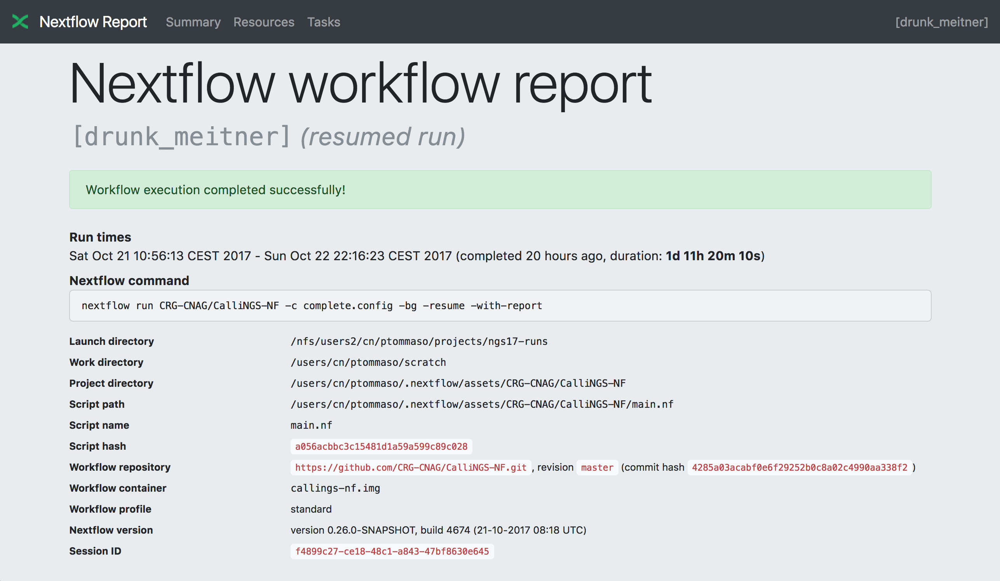
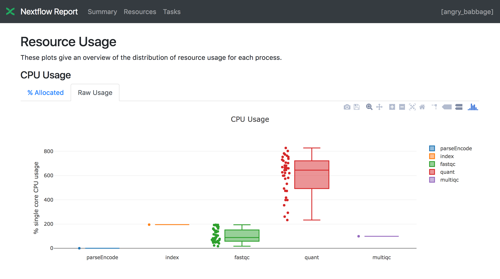
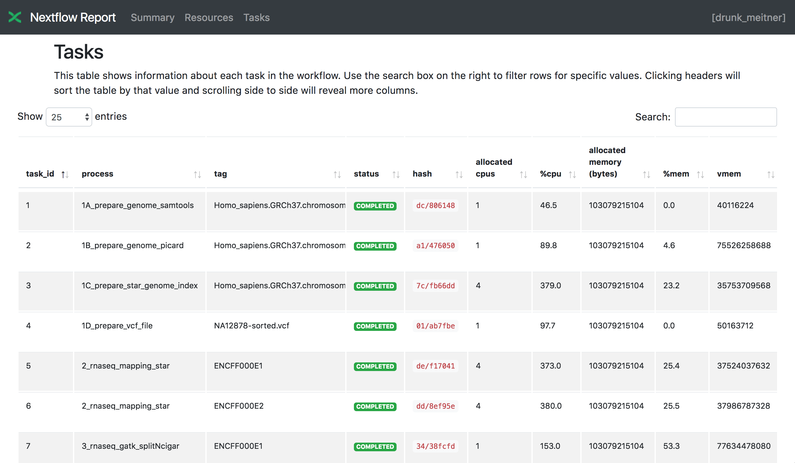
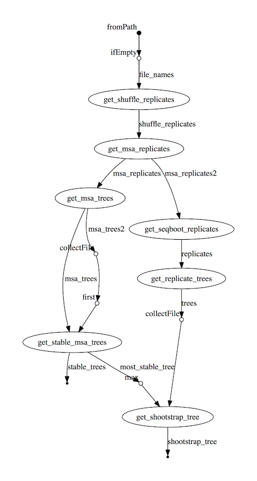

.. _perfanalysis-page:

***********************
Tracing & visualisation
***********************

.. _execution-report:

Execution report
================

Nextflow can create an HTML execution report: a single document which includes many useful metrics
about a workflow execution. The report is organised in the three main sections: `Summary`, `Resources` and `Tasks`
(see below for details).

To enable the creation of this report add the ``-with-report`` command line option when launching the pipeline
execution. For example::

  nextflow run <pipeline name> -with-report [file name]

The report file name can be specified as an optional parameter following the report option.

Summary
-------

The `Summary` section reports the execution status, the launch command, overall execution time and some
other workflow metadata. You can see an example below:

Resource Usage
---------------

The `Resources` sections plots the distributions of resource usages for each workflow process
using the interactive `plotly.js  <https://plot.ly/javascript/>`_ plotting library.

Plots are shown for CPU, memory, job duration and disk I/O. They have two (or three) tabs with the raw values and a percentage representation showing what proportion of the requested resources
were used. These plots are very helpful to check that job pipeline requests are efficient.

Learn more about how resource usage are computed in the :ref:`Metrics documentation <metrics-page>`.

Tasks
-----

Finally the `Tasks` section lists all executed tasks reporting for each of them, the status, the actual command script
and many other runtime metrics. You can see an example below:

.. note:: Nextflow collect these metrics running a background process for each job in the target environment.
  Make sure the following tools are available ``awk``, ``date``, ``grep``, ``egrep``, ``ps``, ``sed``, ``tail``, ``tee`` in the
  system where the jobs are executed. Moreover some of these metrics are not reported when using a Mac OSX system. See the note
  message about that in the `Trace report`_ below.

.. warning:: A common problem when using a third party container image is that it does not ship one or more of the
  above utilities resulting in an empty execution report.

Please read :ref:`Report scope <config-report>` section to learn more about the execution report configuration details.

.. _trace-report:

Trace report
============

Nextflow creates an execution tracing file that contains some useful information about each process executed in your pipeline
script, including: submission time, start time, completion time, cpu and memory used.

In order to create the execution trace file add the ``-with-trace`` command line option when launching the pipeline execution.
For example::

  nextflow run <pipeline name> -with-trace

It will create a file named ``trace.txt`` in the current directory. The content looks like the above example:

======= ========= ========= =============== =========== ======== ======================= =========== =========== ======= =========== =========== =========== ===========
task_id hash      native_id   name          status      exit     submit                  duration    walltime    %cpu    rss         vmem        rchar       wchar
======= ========= ========= =============== =========== ======== ======================= =========== =========== ======= =========== =========== =========== ===========
19      45/ab752a 2032      blast (1)       COMPLETED   0        2014-10-23 16:33:16.288 1m          5s          0.0%    29.8 MB     354 MB      33.3 MB     0
20      72/db873d 2033      blast (2)       COMPLETED   0        2014-10-23 16:34:17.211 30s         10s         35.7%   152.8 MB    428.1 MB    192.7 MB    1 MB
21      53/d13188 2034      blast (3)       COMPLETED   0        2014-10-23 16:34:17.518 29s         20s         4.5%    289.5 MB    381.6 MB    33.3 MB     0
22      26/f65116 2035      blast (4)       COMPLETED   0        2014-10-23 16:34:18.459 30s         9s          6.0%    122.8 MB    353.4 MB    33.3 MB     0
23      88/bc00e4 2036      blast (5)       COMPLETED   0        2014-10-23 16:34:18.507 30s         19s         5.0%    195 MB      395.8 MB    65.3 MB     121 KB
24      74/2556e9 2037      blast (6)       COMPLETED   0        2014-10-23 16:34:18.553 30s         12s         43.6%   140.7 MB    432.2 MB    192.7 MB    182.7 MB
28      b4/0f9613 2041      exonerate (1)   COMPLETED   0        2014-10-23 16:38:19.657 1m 30s      1m 11s      94.3%   611.6 MB    693.8 MB    961.2 GB    6.1 GB
32      af/7f2f57 2044      exonerate (4)   COMPLETED   0        2014-10-23 16:46:50.902 1m 1s       38s         36.6%   115.8 MB    167.8 MB    364 GB      5.1 GB
33      37/ab1fcc 2045      exonerate (5)   COMPLETED   0        2014-10-23 16:47:51.625 30s         12s         59.6%   696 MB      734.6 MB    354.3 GB    420.4 MB
31      d7/eabe51 2042      exonerate (3)   COMPLETED   0        2014-10-23 16:45:50.846 3m 1s       2m 6s       130.1%  703.3 MB    760.9 MB    1.1 TB      28.6 GB
36      c4/d6cc15 2048      exonerate (6)   COMPLETED   0        2014-10-23 16:48:48.718 3m 1s       2m 43s      116.6%  682.1 MB    743.6 MB    868.5 GB    42 GB
30      4f/1ad1f0 2043      exonerate (2)   COMPLETED   0        2014-10-23 16:45:50.961 10m 2s      9m 16s      95.5%   706.2 MB    764 MB      1.6 TB      172.4 GB
52      72/41d0c6 2055      similarity (1)  COMPLETED   0        2014-10-23 17:13:23.543 30s         352ms       0.0%    35.6 MB     58.3 MB     199.3 MB    7.9 MB
57      9b/111b5e 2058      similarity (6)  COMPLETED   0        2014-10-23 17:13:23.655 30s         488ms       0.0%    108.2 MB    158 MB      317.1 MB    9.8 MB
53      3e/bca30f 2061      similarity (2)  COMPLETED   0        2014-10-23 17:13:23.770 30s         238ms       0.0%    6.7 MB      29.6 MB     190 MB      91.2 MB
54      8b/d45b47 2062      similarity (3)  COMPLETED   0        2014-10-23 17:13:23.808 30s         442ms       0.0%    108.1 MB    158 MB      832 MB      565.6 MB
55      51/ac19c6 2064      similarity (4)  COMPLETED   0        2014-10-23 17:13:23.873 30s         6s          0.0%    112.7 MB    162.8 MB    4.9 GB      3.9 GB
56      c3/ec5f4a 2066      similarity (5)  COMPLETED   0        2014-10-23 17:13:23.948 30s         616ms       0.0%    10.4 MB     34.6 MB     238 MB      8.4 MB
98      de/d6c0a6 2099      matrix (1)      COMPLETED   0        2014-10-23 17:14:27.139 30s         1s          0.0%    4.8 MB      42 MB       240.6 MB    79 KB
======= ========= ========= =============== =========== ======== ======================= =========== =========== ======= =========== =========== =========== ===========

.. _trace-fields:

The following table shows the fields that can be included in the execution report:

======================= ===============
Name                    Description
======================= ===============
task_id                 Task ID.
hash                    Task hash code.
native_id               Task ID given by the underlying execution system e.g. POSIX process PID when executed locally, job ID when executed by a grid engine, etc.
process                 Nextflow process name.
tag                     User provided identifier associated this task.
name                    Task name.
status                  Task status.
exit                    POSIX process exit status.
module                  Environment module used to run the task.
container               Docker image name used to execute the task.
cpus                    The cpus number request for the task execution.
time                    The time request for the task execution
disk                    The disk space request for the task execution.
memory                  The memory request for the task execution.
attempt                 Attempt at which the task completed.
submit                  Timestamp when the task has been submitted.
start                   Timestamp when the task execution has started.
complete                Timestamp when task execution has completed.
duration                Time elapsed to complete since the submission.
realtime                Task execution time i.e. delta between completion and start timestamp.
queue                   The queue that the executor attempted to run the process on.
%cpu                    Percentage of CPU used by the process.
%mem                    Percentage of memory used by the process.
rss                     Real memory (resident set) size of the process. Equivalent to ``ps -o rss`` .
vmem                    Virtual memory size of the process. Equivalent to ``ps -o vsize`` .
peak_rss                Peak of real memory. This data is read from field ``VmHWM`` in ``/proc/$pid/status`` file.
peak_vmem               Peak of virtual memory. This data is read from field ``VmPeak`` in ``/proc/$pid/status`` file.
rchar                   Number of bytes the process read, using any read-like system call from files, pipes, tty, etc. This data is read from file ``/proc/$pid/io``.
wchar                   Number of bytes the process wrote, using any write-like system call. This data is read from file ``/proc/$pid/io``.
syscr                   Number of read-like system call invocations that the process performed. This data is read from file ``/proc/$pid/io``.
syscw                   Number of write-like system call invocations that the process performed. This data is read from file ``/proc/$pid/io``.
read_bytes              Number of bytes the process directly read from disk. This data is read from file ``/proc/$pid/io``.
write_bytes             Number of bytes the process originally dirtied in the page-cache (assuming they will go to disk later). This data is read from file ``/proc/$pid/io``.
vol_ctxt                Number of voluntary context switches.
inv_ctxt                Number of involuntary context switches.
======================= ===============

.. note:: These numbers provide an estimation of the resources used by running tasks. They should not be intended as an alternative
  to low level performance analysis provided by other tools and they may not be fully accurate, in particular for very short-lived tasks
  (running for less than one second).

Trace report layout and other configuration settings can be specified by using the ``nextflow.config`` configuration file.

Please read :ref:`Trace scope <config-trace>` section to learn more about it.

.. _timeline-report:

Timeline report
===============

Nextflow can render an HTML timeline for all processes executed in your pipeline. An example of the timeline
report is shown below:

.. image:: images/timeline-min.png

Each bar represents a process run in the pipeline execution. The bar length represents the task duration time (wall-time).
The colored area in each bar represents the real execution time. The grey area to the *left* of the colored area represents
the task scheduling wait time. The grey area to the *right* of the colored area represents the task termination time
(clean-up and file un-staging). The numbers on the x-axis represent the time in absolute units eg. minutes, hours, etc.

Each bar displays two numbers: the task duration time and the virtual memory size peak.

As each process can spawn many tasks, colors are used to identify those tasks belonging to the same process.

To enable the creation of the timeline report add the ``-with-timeline`` command line option when launching the pipeline
execution. For example::

  nextflow run <pipeline name> -with-timeline [file name]

The report file name can be specified as an optional parameter following the timeline option.

.. _dag-visualisation:

DAG visualisation
=================

A Nextflow pipeline is implicitly modelled by a direct acyclic graph (DAG). The vertices in the graph represent
the pipeline's processes and operators, while the edges represent the data connections (i.e. channels) between them.

The pipeline execution DAG can be outputted by adding the ``-with-dag`` option to the run command line.
It creates a file named ``dag.dot`` containing a textual representation of the pipeline execution graph
in the `DOT format <http://www.graphviz.org/content/dot-language>`_.

The execution DAG can be rendered in a different format by specifying an output file name which has an extension
corresponding to the required format. For example::

    nextflow run <script-name> -with-dag flowchart.png

List of supported file formats:

============ ====================
Extension     File format
============ ====================
dot           Graphviz DOT file
html          HTML file
pdf           PDF file (*)
png           PNG file (*)
svg           SVG file (*)
============ ====================

.. warning:: The file formats marked with a `*` require the `Graphviz <http://www.graphviz.org>`_ tool installed
  in your computer.

The DAG produced by Nextflow for the `Shootstrap <https://github.com/cbcrg/shootstrap/>`_ pipeline:

.. _weblog-service:

Weblog via HTTP
===============

Nextflow is able to send detailed workflow execution metadata and runtime statistics to a HTTP endpoint.
To enable this feature use  the ``-with-weblog`` as shown below::

  nextflow run <pipeline name> -with-weblog [url]

Workflow events are sent as HTTP POST requests to the given URL. The message is formatted using the
following JSON structure::

   {
        "runName": <run name>,
        "runId": <uuid>,
        "event": <started|process_submitted|process_started|process_completed|error|completed>,
        "utcTime": <UTC timestamp>,
        "trace": { ... },
        "metadata": { ... }
   }

The JSON object contains the following attributes:

================== ================
Attribute          Description
================== ================
runName            The workflow execution run name.
runId              The workflow execution unique ID.
event              The workflow execution event. One of ``started``, ``process_submitted``, ``process_started``, ``process_completed``, ``error``, ``completed``.
utcTime            The UTC timestamp in ISO 8601 format.
trace              A process runtime information as described in the :ref:`trace fields<trace-fields>` section. This attribute is only provided for the following events: ``process_submitted``, ``process_started``, ``process_completed``, ``error``.
metadata           The workflow metadata including the :ref:`config manifest<config-manifest>`. For a list of all fields, have a look at the bottom message examples. This attribute is only provided for the following events: ``started``, ``completed``.
================== ================

.. warning::
  The content of the ``trace`` attribute depends on the settings for the `Trace report <trace-report>`_ defined in the
  ``nextflow.config`` file. See the :ref:`Trace configuration<config-trace>` section to learn more.

Weblog Started example message
------------------------------

When a workflow execution is started, a message like the following is posted to the specified end-point. Be aware that the
properties in the parameter scope will look different for your workflow. This is an example output from the ``nf-core/hlatyping``
pipeline with the weblog feature enabled::

  {
    "runName": "friendly_pesquet",
    "runId": "170aa09c-105f-49d0-99b4-8eb6a146e4a7",
    "event": "started",
    "utcTime": "2018-10-07T11:42:08Z",
    "metadata": {
            "params": {
                "container": "nfcore/hlatyping:1.1.4",
                "help": false,
                "outdir": "results",
                "bam": true,
                "singleEnd": false,
                "single-end": false,
                "reads": "data/test*{1,2}.fq.gz",
                "seqtype": "dna",
                "solver": "glpk",
                "igenomes_base": "./iGenomes",
                "multiqc_config": "/Users/sven1103/.nextflow/assets/nf-core/hlatyping/conf/multiqc_config.yaml",
                "clusterOptions": false,
                "cluster-options": false,
                "enumerations": 1,
                "beta": 0.009,
                "prefix": "hla_run",
                "base_index": "/Users/sven1103/.nextflow/assets/nf-core/hlatyping/data/indices/yara/hla_reference_",
                "index": "/Users/sven1103/.nextflow/assets/nf-core/hlatyping/data/indices/yara/hla_reference_dna",
                "custom_config_version": "master",
                "custom_config_base": "https://raw.githubusercontent.com/nf-core/configs/master"
            },
            "workflow": {
                "start": "2019-03-25T12:09:52Z",
                "projectDir": "/Users/sven1103/.nextflow/assets/nf-core/hlatyping",
                "manifest": {
                    "nextflowVersion": ">=18.10.1",
                    "defaultBranch": "master",
                    "version": "1.1.4",
                    "homePage": "https://github.com/nf-core/hlatyping",
                    "gitmodules": null,
                    "description": "Precision HLA typing from next-generation sequencing data.",
                    "name": "nf-core/hlatyping",
                    "mainScript": "main.nf",
                    "author": null
                },
                "complete": null,
                "profile": "docker,test",
                "homeDir": "/Users/sven1103",
                "workDir": "/Users/sven1103/git/nextflow/work",
                "container": "nfcore/hlatyping:1.1.4",
                "commitId": "4bcced898ee23600bd8c249ff085f8f88db90e7c",
                "errorMessage": null,
                "repository": "https://github.com/nf-core/hlatyping.git",
                "containerEngine": "docker",
                "scriptFile": "/Users/sven1103/.nextflow/assets/nf-core/hlatyping/main.nf",
                "userName": "sven1103",
                "launchDir": "/Users/sven1103/git/nextflow",
                "runName": "shrivelled_cantor",
                "configFiles": [
                    "/Users/sven1103/.nextflow/assets/nf-core/hlatyping/nextflow.config"
                ],
                "sessionId": "7f344978-999c-480d-8439-741bc7520f6a",
                "errorReport": null,
                "scriptId": "2902f5aa7f297f2dccd6baebac7730a2",
                "revision": "master",
                "exitStatus": null,
                "commandLine": "./launch.sh run nf-core/hlatyping -profile docker,test -with-weblog 'http://localhost:4567'",
                "nextflow": {
                              "version": "19.03.0-edge",
                              "build": 5137,
                              "timestamp": "2019-03-28T14:46:55Z"
                            },
                },
                "stats": {
                    "computeTimeFmt": "(a few seconds)",
                    "cachedCount": 0,
                    "cachedDuration": 0,
                    "failedDuration": 0,
                    "succeedDuration": 0,
                    "failedCount": 0,
                    "cachedPct": 0.0,
                    "cachedCountFmt": "0",
                    "succeedCountFmt": "0",
                    "failedPct": 0.0,
                    "failedCountFmt": "0",
                    "ignoredCountFmt": "0",
                    "ignoredCount": 0,
                    "succeedPct": 0.0,
                    "succeedCount": 0,
                    "ignoredPct": 0.0
                },
                "resume": false,
                "success": false,
                "scriptName": "main.nf",
                "duration": null
            }
        }
  }

Weblog Completed example message
--------------------------------

Once a process is completed, a message like the following is posted to the specified end-point::

  {
    "runName": "friendly_pesquet",
    "runId": "170aa09c-105f-49d0-99b4-8eb6a146e4a7",
    "event": "process_completed",
    "utcTime": "2018-10-07T11:45:30Z",
    "trace": {
        "task_id": 2,
        "status": "COMPLETED",
        "hash": "a1/0024fd",
        "name": "make_ot_config",
        "exit": 0,
        "submit": 1538912529498,
        "start": 1538912529629,
        "process": "make_ot_config",
        "tag": null,
        "module": [

        ],
        "container": "nfcore/hlatyping:1.1.1",
        "attempt": 1,
        "script": "\n    configbuilder --max-cpus 2 --solver glpk > config.ini\n    ",
        "scratch": null,
        "workdir": "/home/sven1103/git/hlatyping-workflow/work/a1/0024fd028375e2b601aaed44d112e3",
        "queue": null,
        "cpus": 1,
        "memory": 7516192768,
        "disk": null,
        "time": 7200000,
        "env": "PATH=/home/sven1103/git/hlatyping-workflow/bin:$PATH\n",
        "error_action": null,
        "complete": 1538912730599,
        "duration": 201101,
        "realtime": 69,
        "%cpu": 0.0,
        "%mem": 0.1,
        "vmem": 54259712,
        "rss": 10469376,
        "peak_vmem": 20185088,
        "peak_rss": 574972928,
        "rchar": 7597,
        "wchar": 162,
        "syscr": 16,
        "syscw": 4083712,
        "read_bytes": 4096,
        "write_bytes": 0,
        "native_id": 27185
    }
  }
