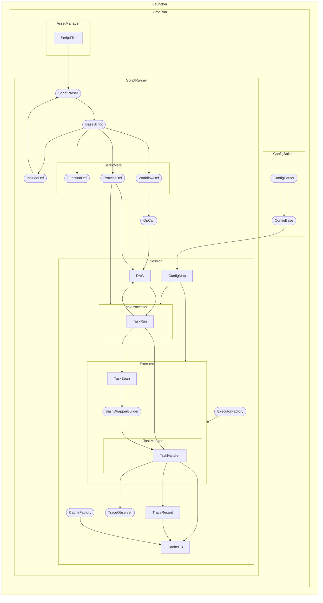

# Workflow diagram

The following diagram is a high-level overview of the Nextflow source code in a similar style as the [workflow diagram][workflow-diagram] visualization for Nextflow pipelines. Each node and subgraph is a class. Arrows depict the flow of data and/or communication between classes.

In general, nodes with sharp corners are "record" classes that simply hold information, while nodes with rounded edges are "function" classes that transform some input into an output. Subgraphs are either long-running classes, i.e. "places where things happen", or one of the other two types for which it was useful to expand and show internal details.

[nextflow-diagram]: ../reports#workflow-diagram
