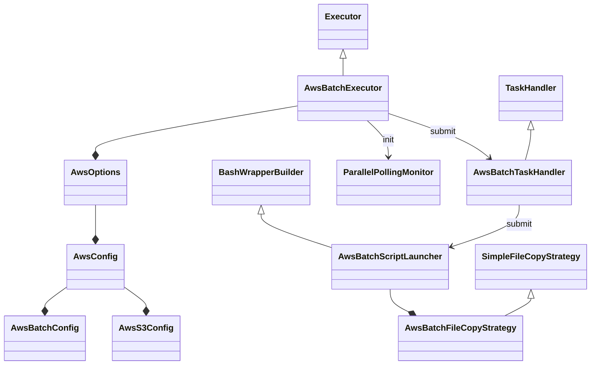

# `nextflow.cloud.aws`

The `nextflow.cloud.aws` package implements the AWS Batch executor.

## Class Diagram

```mermaid
classDiagram
    %%
    %% nextflow.cloud.aws
    %%
    Executor <|-- AwsBatchExecutor
    TaskHandler <|-- AwsBatchTaskHandler
    BashWrapperBuilder <|-- AwsBatchScriptLauncher

    AwsBatchExecutor --* AwsOptions
    AwsOptions --* AwsConfig
    AwsConfig --* AwsBatchConfig
    AwsConfig --* AwsS3Config

    AwsBatchExecutor --> ParallelPollingMonitor : init
    AwsBatchExecutor --> AwsBatchTaskHandler : submit
    AwsBatchTaskHandler --> AwsBatchScriptLauncher : submit

    %% TaskPollingMonitor <|-- ParallelPollingMonitor

    SimpleFileCopyStrategy <|-- AwsBatchFileCopyStrategy
    AwsBatchScriptLauncher --* AwsBatchFileCopyStrategy

```

:::note
Some classes may be excluded from the above diagrams for brevity.
:::
