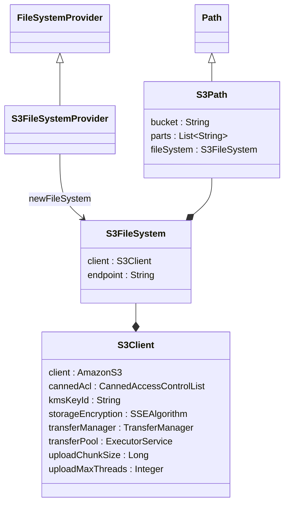

# `nextflow.cloud.aws.nio`

The `nextflow.cloud.aws.nio` package implements the S3 filesystem.

## Class Diagram

:::note
Some classes may be excluded from the above diagrams for brevity.
:::

## Notes

The S3 filesystem translates Java Path API calls into S3 API calls, which allows Nextflow to interact with S3 objects through the same interface for local files.
