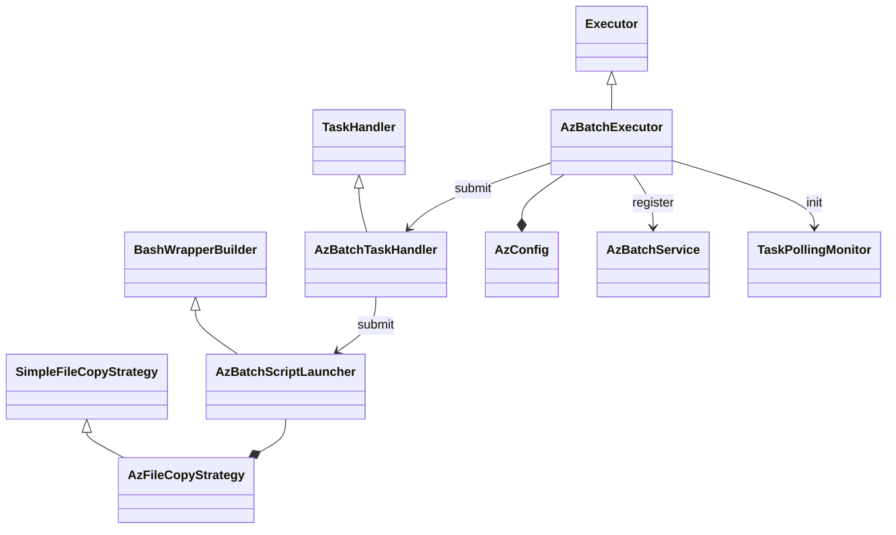

# `nextflow.cloud.azure`

The `nextflow.cloud.azure` package implements the Azure Batch executor.

## Class Diagram

```mermaid
classDiagram
    %%
    %% nextflow.cloud.azure
    %%
    Executor <|-- AzBatchExecutor
    TaskHandler <|-- AzBatchTaskHandler
    BashWrapperBuilder <|-- AzBatchScriptLauncher

    AzBatchExecutor --* AzConfig
    AzBatchExecutor --> AzBatchService : register

    AzBatchExecutor --> TaskPollingMonitor : init
    AzBatchExecutor --> AzBatchTaskHandler : submit
    AzBatchTaskHandler --> AzBatchScriptLauncher : submit

    SimpleFileCopyStrategy <|-- AzFileCopyStrategy
    AzBatchScriptLauncher --* AzFileCopyStrategy

```

:::note
Some classes may be excluded from the above diagram for brevity.
:::
