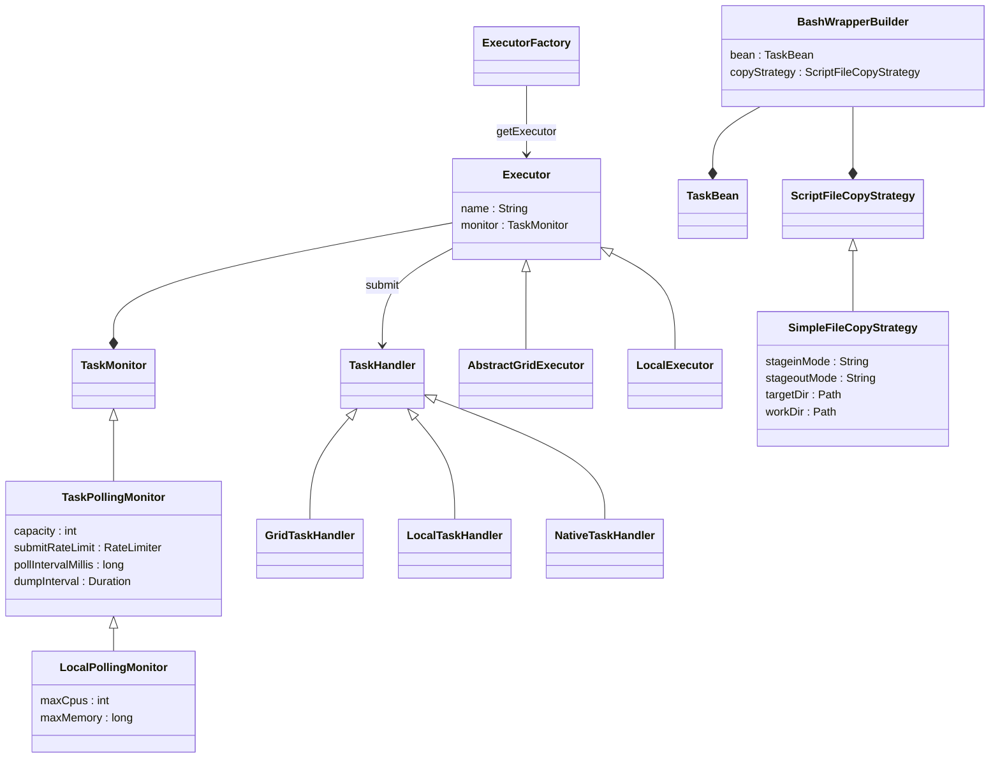

# `nextflow.executor`

The `nextflow.executor` package defines the executor interface and implements several built-in executors.

## Class Diagram

:::note
Some classes may be excluded from the above diagram for brevity.
:::

## Notes

The `Executor` class is the base class for all Nextflow executors. The main purpose of an `Executor` is to submit tasks to an underlying compute environment, such as an HPC scheduler or cloud batch executor. It uses a `TaskMonitor` to manage the lifecycle of all tasks and a `TaskHandler` to manage each individual task. Most executors use the same polling monitor, but each executor implements its own task handler to customize it for a particular compute environment.
See [nextflow.processor][nextflow.processor] for more details about these classes.

The built-in executors include the local executor (`LocalExecutor`) and the various grid executors (SLURM, PBS, LSF, etc), all of which extend `AbstractGridExecutor`. The `LocalExecutor` implements both "script" tasks (processes with a `script` or `shell` block) and "native" tasks (processes with an `exec` block).

The `BashWrapperBuilder` is used by executors to generate the wrapper script (`.command.run`) for a task, from a template script called `command-run.txt`, as well as the task configuration and the execution environment.

[nextflow.processor]: /docs/developer/nextflow.processor.mdx