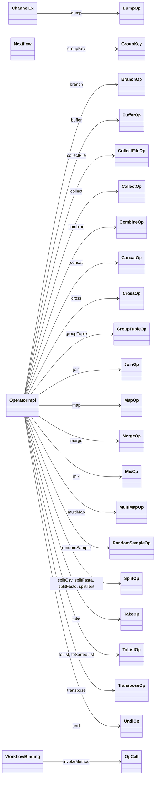

# `nextflow.extension`

The `nextflow.extension` package implements the channel operators and other extension methods.

## Class Diagram

:::note
Some classes may be excluded from the above diagram for brevity.
:::

## Notes

Operators are implemented using the [GPars](http://gpars.org/1.2.1/guide/guide/dataflow.html) dataflow library. In general, an operator consumes one or more `DataflowReadChannel`s and produces one or more `DataflowWriteChannel`s. See [Operators][operator-page] for details about each operator.

Other notable classes include `Bolts` and `FilesEx`, which implement various extension methods used throughout the Nextflow codebase. If you see a method that doesn't appear to be implemented by the calling object, it may be implemented in one of these extension classes.

[operator-page]: ../reference/operator