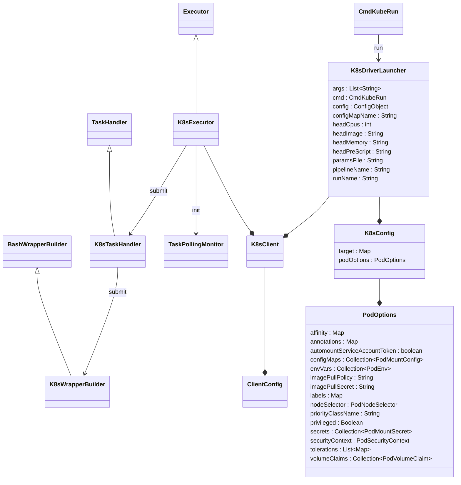

# `nextflow.k8s`

The `nextflow.k8s` package implements the Kubernetes executor and the `kuberun` command.

## Class Diagram

:::note
Some classes may be excluded from the above diagram for brevity.
:::

## Notes

The Kubernetes integration uses the K8s HTTP API to interact with K8s clusters, and relies on the `kubectl` command and `~/.kube/config` file for authentication.
