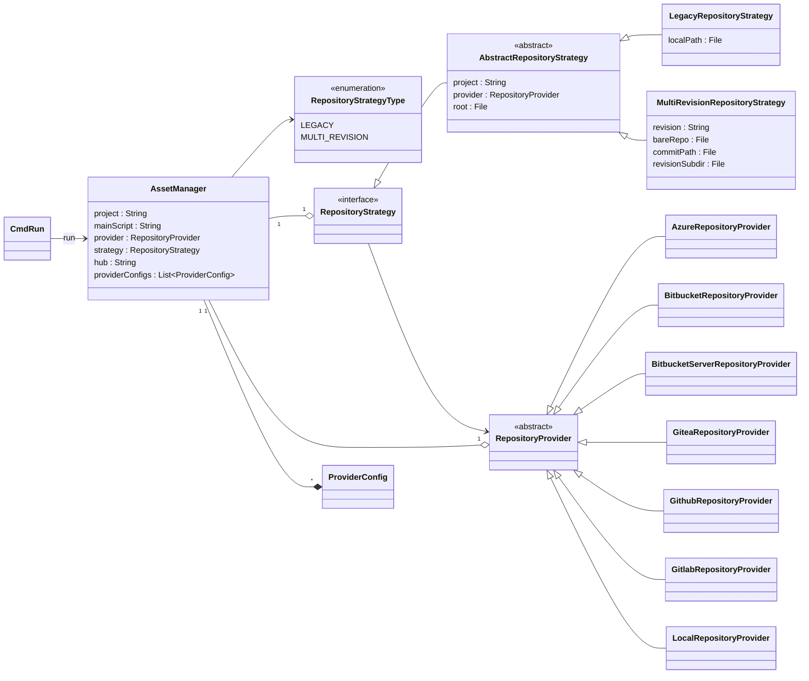

# `nextflow.scm`

The `nextflow.scm` package defines the Git provider interface and implements several built-in Git providers. It also manages local pipeline repositories using a Strategy pattern to support different repository management approaches.

## Class Diagram



```note
Some classes may be excluded from the above diagram for brevity.
```

## Architecture overview

### Repository strategies

The `AssetManager` uses the **Strategy pattern** to support different ways of managing local pipeline installations:

- **`LegacyRepositoryStrategy`**: Traditional approach where each project gets a full git clone in `$NXF_HOME/{project}` directory. Only one revision can exist at a time per project.

- **`MultiRevisionRepositoryStrategy`**: Modern approach that allows multiple revisions to coexist efficiently by:
  - Maintaining a shared bare repository in `$NXF_HOME/.repos/{project}/bare/`
  - Creating lightweight clones for each commit in `$NXF_HOME/.repos/{project}/clones/{commitId}/`
  - Sharing git objects between revisions to minimize disk space

### Strategy selection

The `AssetManager` automatically selects the appropriate strategy based on:

1. **Environment variable**: `NXF_SCM_LEGACY=true` forces legacy mode
2. **Repository status**: Detected by checking existing repository structure:
   - `UNINITIALIZED`: No repository exists, use Multi-Revision (default)
   - `LEGACY_ONLY`: Only legacy `.git` directory exists, use Legacy
   - `BARE_ONLY`: Only bare repository exists, use Multi-Revision
   - `HYBRID`: Both exist, prefer Multi-Revision

### Repository provider

The `RepositoryProvider` class is the base class for all Git providers. It defines how to authenticate with the provider, clone a Git repository, inspect branches and tags, etc. The provider is used by repository strategies to interact with remote Git services.

## Key components

### AssetManager

Central class that manages pipeline assets. Key responsibilities include:

- Project name resolution and validation
- Strategy selection and initialization
- Provider configuration and authentication
- Repository download and checkout operations
- Coordination between strategy and provider

### RepositoryStrategy

Interface defining for repository management operations:
- `download()`: Download or update a revision
- `checkout()`: Switch to a specific revision
- `drop()`: Delete local copies
- `getLocalPath()`: Get path to working directory
- `getGit()`: Access JGit repository instance
