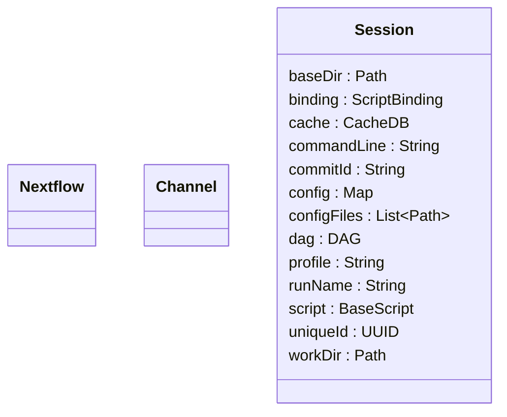

# `nextflow`

The `nextflow` package contains various top-level classes.

## Class Diagram



```note
Some classes may be excluded from the above diagram for brevity.
```

## Notes

The `Nextflow` class implements several methods that are exposed to Nextflow scripts. See [Global namespace][stdlib-namespaces-global] for details.

The `Channel` class implements the channel factory methods, and it is exposed directly to Nextflow scripts. See [Dataflow][channel-page] for details.

The `Session` class is the top-level representation of a Nextflow run, or "session". See [nextflow.script][nextflow-script] for more details about how a `Session` is created.

[dataflow-page]: /nextflow_docs/nextflow_repo/docs/channel.mdx
[nextflow-script]: /nextflow_docs/nextflow_repo/docs/developer/nextflow.script.mdx
[stdlib-namespaces-global]: /nextflow_docs/nextflow_repo/docs/reference/stdlib-namespaces.mdx#global-namespace