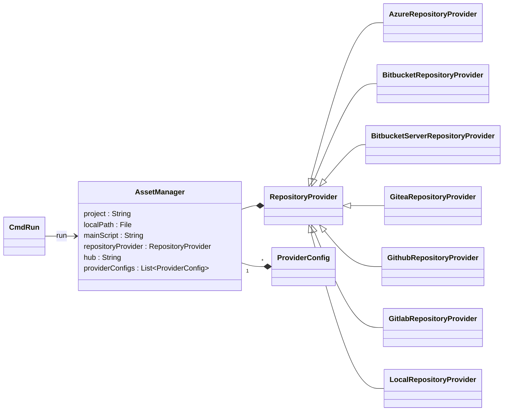

# `nextflow.scm`

The `nextflow.scm` package defines the Git provider interface and implements several built-in Git providers.

## Class Diagram

:::note
Some classes may be excluded from the above diagram for brevity.
:::

## Notes

The `RepositoryProvider` class is the base class for all Git providers. It defines how to authenticate with the provider, clone a Git repository, inspect branches and tags, etc.
