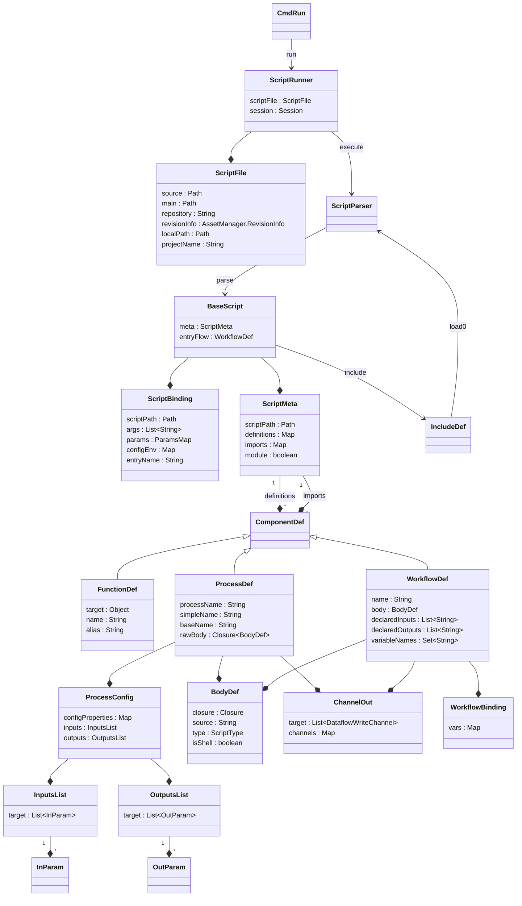

# `nextflow.script`

The `nextflow.script` package implements the parsing and execution of Nextflow scripts.

## Class Diagram

:::note
Some classes may be excluded from the above diagram for brevity.
:::

## Notes

The execution of a Nextflow pipeline occurs in two phases. In the first phase, Nextflow parses and runs the script (using the language extensions in [nextflow.ast][nextflow-ast] and [nextflow.extension][nextflow-extension]), which produces the workflow DAG. In the second phase, Nextflow executes the workflow.

:::note
In DSL1, there was no separation between workflow construction and execution -- dataflow operators were executed as soon as they were constructed. DSL2 introduced lazy execution in order to separate process definition from execution, and thereby facilitate subworkflows and modules.
:::

[nextflow-ast]: /nextflow_docs/nextflow_repo/docs/developer/nextflow.ast.mdx
[nextflow-extension]: /nextflow_docs/nextflow_repo/docs/developer/nextflow.extension.mdx
